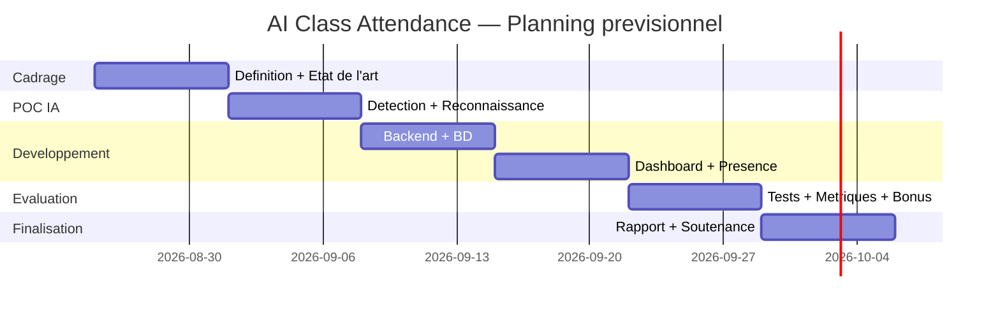

# AI Class Attendance for Students
## Document d'analyse et de conception (contexte principal du projet)

> **Statut :** brouillon de travail — à valider par l'équipe et l'encadrant.
> Ce document constitue le **contexte de référence** du PFA. Il sera enrichi au fil des séances et servira de base directe à la rédaction du rapport.

---

## 0. Fiche projet

| Élément | Détail |
|---|---|
| **Titre** | AI Class Attendance for Students — Système intelligent de gestion des présences par reconnaissance faciale |
| **Type** | PFA — 2ᵉ année Cycle d'ingénieur (2025–2026) |
| **Établissement** | ISGA |
| **Encadrant** | M. Adama SAMAKE |
| **Équipe (3 étudiants)** | BENDADI Mohamed (porteur de l'idée) · SADEK Zakaria · BELHASSAN Amine |
| **Idée d'origine** | Proposée par M. BENDADI — intégration de l'IA dans un contexte éducatif |
| **Prochain jalon** | Séance d'encadrement — début septembre 2026 (point d'avancement + directives avant soutenance) |
| **Deadline Phase 1 (définition)** | 13/07/2026 (cadre méthodologique de la séance 1) |

---

## 1. Contexte général

La gestion de la présence des étudiants est une activité quotidienne et obligatoire dans les établissements d'enseignement supérieur. Elle conditionne le suivi pédagogique, le respect du règlement (assiduité), et l'évaluation.

Aujourd'hui, dans la majorité des établissements — y compris à l'ISGA — l'appel se fait de façon **manuelle** : appel nominal par l'enseignant ou feuille de présence qui circule et que les étudiants signent. Ces méthodes, héritées d'une organisation non numérisée, sont chronophages et peu fiables.

En parallèle, l'**intelligence artificielle** — et en particulier la **vision par ordinateur** — a atteint un niveau de maturité qui rend la reconnaissance faciale exploitable sur du matériel courant, avec des précisions supérieures à celles de l'humain sur des jeux de référence (> 99 % sur LFW). Il devient donc pertinent d'automatiser l'appel par la reconnaissance des visages des étudiants.

Ce projet s'inscrit à l'intersection de deux dynamiques d'actualité : la **transformation numérique de l'éducation** et l'**IA appliquée**.

---

## 2. Problématique

Les méthodes actuelles de prise de présence présentent plusieurs limites :

1. **Perte de temps pédagogique** — l'appel manuel consomme 5 à 10 minutes par séance, soit un volume horaire important sur un semestre.
2. **Fraude à la présence (« proxy attendance »)** — un étudiant peut répondre ou signer à la place d'un camarade absent.
3. **Fiabilité et traçabilité** — les feuilles papier se perdent, sont raturées, difficilement archivables.
4. **Absence d'exploitation des données** — aucune statistique automatique (taux d'assiduité par étudiant, par module, alertes d'absentéisme) n'est disponible pour l'administration.
5. **Charge administrative** — la saisie et le suivi manuels mobilisent du personnel.

> **Question de recherche / problématique :**
> *Comment concevoir et réaliser un système fiable, rapide et éthique qui automatise la prise de présence en classe à partir de la reconnaissance faciale des étudiants, tout en garantissant la protection de leurs données personnelles ?*

Sous-questions :
- Quelle chaîne de traitement (détection + reconnaissance) offre le meilleur compromis précision / rapidité sur du matériel standard ?
- Comment gérer les conditions réelles d'une salle de classe (éclairage, angles, distance, plusieurs visages) ?
- Comment prévenir la fraude (présentation d'une photo) ?
- Comment se conformer à la réglementation marocaine sur les données biométriques (loi 09-08 / CNDP) ?

---

## 3. Objectifs

### 3.1 Objectif général
Concevoir et développer une **application de gestion automatique des présences** qui identifie les étudiants présents à partir d'une image (photo ou flux webcam) de la salle, enregistre les présences dans une base de données et fournit à l'enseignant un tableau de bord de suivi.

### 3.2 Objectifs spécifiques — fonctionnels
- **F1.** Enrôler les étudiants (constitution d'une base de visages de référence).
- **F2.** Détecter et reconnaître les visages présents sur une image de classe.
- **F3.** Marquer automatiquement présent / absent par séance, avec date et heure.
- **F4.** Permettre à l'enseignant de valider / corriger la liste avant enregistrement.
- **F5.** Générer des rapports d'assiduité (par étudiant, par module, par période) et les exporter (Excel/PDF).
- **F6.** Gérer les entités pédagogiques (étudiants, modules, séances, classes).

### 3.3 Objectifs spécifiques — techniques / qualité
- **T1.** Atteindre une précision de reconnaissance élevée dans des conditions maîtrisées (**cible ≥ 90–95 %**).
- **T2.** Temps de traitement compatible avec un usage en classe (**quelques secondes** par image).
- **T3.** Fonctionner sur **matériel standard** (ordinateur portable, CPU, webcam).
- **T4.** Respecter la **conformité réglementaire** (consentement, minimisation, sécurité).
- **T5.** *(Bonus)* Détecter les tentatives de fraude par photo (**anti-spoofing / liveness**).

---

## 4. Périmètre du projet

> **Décision de l'équipe : on vise le système complet, pas un MVP réduit.** L'ensemble des fonctionnalités ci-dessous fait partie du périmètre. L'ordre de réalisation reste incrémental (à chaque étape, une brique fonctionne), mais l'objectif livré est le produit complet.

### 4.1 Périmètre (système complet)
- Module d'**enrôlement** des étudiants (photos → vecteurs de référence).
- **Reconnaissance sur photo de classe** (image importée).
- **Reconnaissance en flux vidéo temps réel** (webcam en continu).
- **Anti-spoofing / liveness** (détection photo vs personne réelle).
- **Marquage des présences** (présent / absent / retard) et enregistrement en base.
- **Validation / correction** manuelle par l'enseignant.
- **Tableau de bord** enseignant : présences par séance, statistiques, exports (Excel/PDF).
- **Alertes** automatiques d'absentéisme (email).
- **Portail étudiant** : consultation du taux de présence personnel.
- **Gestion** des utilisateurs, classes, modules, séances, étudiants.

### 4.2 Perspectives (au-delà du périmètre livré)
- **Application mobile native** dédiée (l'interface web sera responsive en attendant).
- Intégration au **système d'information** de l'établissement.
- Déploiement **multi-campus** / mise en production à grande échelle.

### 4.3 Hors périmètre
- Reconnaissance des **émotions** ou du comportement en classe.
- **Entraînement** d'un modèle de reconnaissance à partir de zéro (on utilise des modèles **pré-entraînés**).
- Intégration au **système d'information** officiel de l'établissement.
- Déploiement **multi-campus** / mise en production à grande échelle.

### 4.4 Hypothèses
- Les étudiants **consentent** à l'enrôlement (cadre pédagogique, données non diffusées).
- Nombre d'étudiants par classe **modéré** (dizaines), conditions d'éclairage **raisonnables**.
- Matériel disponible : ordinateur portable + webcam / smartphone pour les photos.

---

## 5. Étude de l'existant — État de l'art

### 5.1 Solutions et travaux existants
La reconnaissance faciale appliquée à l'assiduité est un sujet **mûr et abondamment étudié**. On distingue :
- **Solutions commerciales / open-source** : systèmes de « smart attendance » basés sur OpenCV, DeepFace, InsightFace ; pointeuses biométriques.
- **Travaux académiques récents** (2023–2025) : nombreux articles sur l'appel automatique en classe, en image fixe (photo de groupe) ou en vidéo (CCTV / webcam), rapportant des précisions de **95 % à 99 %** selon les conditions [2][3][8].

### 5.2 La chaîne de traitement type (pipeline)
La quasi-totalité des systèmes suit la même architecture en 3 grandes étapes [1][10] :

1. **Détection de visages** — localiser tous les visages dans l'image.
2. **Extraction de caractéristiques (embedding)** — transformer chaque visage en un **vecteur numérique** (128 à 512 dimensions) qui « résume » l'identité.
3. **Appariement (matching)** — comparer ce vecteur à la base des étudiants enrôlés (distance cosinus / euclidienne + seuil) pour décider de l'identité.

### 5.3 Technologies clés

**Détection**
| Méthode | Caractéristiques |
|---|---|
| Haar Cascade (OpenCV) | Très rapide, ancienne, peu robuste (angles, occlusions) |
| HOG (dlib) | Bon compromis, CPU |
| MTCNN | Bonne précision, plus lourd |
| **RetinaFace** | **État de l'art**, robuste (petits visages, angles), landmarks |
| YOLOv5-face | Rapide pour scènes denses (classe entière) |

**Reconnaissance (embedding) — précision sur le benchmark LFW** [4]
| Modèle | Précision LFW | Dimensions | Remarque |
|---|---|---|---|
| dlib (ResNet-34) | ~99,38 % | 128 | Simple à installer, CPU-friendly |
| FaceNet | ~99,65 % | 128/512 | Très répandu |
| **ArcFace (InsightFace)** | **~99,4–99,86 %** | 512 | **État de l'art**, marge angulaire |

> Repère de performance d'un pipeline combiné **RetinaFace + FaceNet** : taux de reconnaissance Rank-1 de **99,11 %** pour ~**119 ms/image** [1]. Précision humaine de référence sur LFW : ~97,5 % — les modèles modernes **dépassent l'humain** [4].

**Anti-spoofing / liveness (fraude)** [5]
Protège contre les **attaques de présentation** (photo imprimée, vidéo rejouée, masque). Approches : analyse de texture/CNN, détection du clignement des yeux, méthodes mono-image, apprentissage « one-class » vs « two-class ». Sujet riche pour l'état de l'art et différenciant pour la soutenance.

### 5.4 Limites identifiées dans la littérature
Les performances **chutent en conditions réelles** : mauvais éclairage, angles de caméra, distance, occlusions (masque, lunettes), classes denses (visages petits/flous) [2]. Ces limites orienteront notre **chapitre Résultats** (analyse critique) et nos choix de conception (multi-photos d'enrôlement, prétraitement, validation enseignant).

### 5.5 Positionnement de notre projet
Nous ne cherchons pas à inventer un nouveau modèle, mais à **intégrer les meilleures briques existantes** (RetinaFace + ArcFace/InsightFace, avec dlib/`face_recognition` en solution de repli) dans une **application complète, utilisable et conforme**, avec une **évaluation rigoureuse** et une extension **anti-spoofing**.

---

## 6. Acteurs et cas d'utilisation

### 6.1 Acteurs
- **Enseignant** — lance l'appel, valide la liste, consulte les rapports.
- **Administrateur / responsable pédagogique** — gère étudiants, modules, enrôlement, utilisateurs.
- **Étudiant** *(optionnel)* — consulte son taux de présence.
- **Système (IA)** — détecte, reconnaît, marque, alerte.

### 6.2 Cas d'utilisation principaux
- S'authentifier.
- Gérer les étudiants et **enrôler** leurs photos.
- Créer / planifier une **séance**.
- **Lancer la reconnaissance** (importer une photo de classe ou capturer via webcam).
- **Vérifier et corriger** la liste des présents.
- **Enregistrer** les présences.
- **Consulter / exporter** les rapports d'assiduité.
- *(Bonus)* Recevoir une **alerte** d'absentéisme.

*(Diagramme de cas d'utilisation UML à produire au chapitre Conception.)*

---

## 7. Architecture de la solution

### 7.1 Architecture fonctionnelle (6 modules)
1. **Enrôlement** — capture/import des photos, calcul et stockage des vecteurs de référence.
2. **Détection** — localisation des visages dans l'image de classe.
3. **Reconnaissance** — embedding + appariement à la base des étudiants.
4. **Logique de présence** — décision présent/absent/retard, horodatage, rattachement à la séance.
5. **Tableau de bord** — interface enseignant : listes, statistiques, exports, alertes.
6. **Persistance** — base de données (étudiants, modules, séances, présences).

### 7.2 Pipeline IA détaillé
```
Image de classe (photo / webcam)
        │
        ▼
[1] Détection des visages ......... RetinaFace / MTCNN / HOG
        │  (boîtes + points de repère)
        ▼
[2] Alignement & prétraitement .... recadrage, normalisation
        │
        ▼
[3] Extraction embedding .......... ArcFace / FaceNet / dlib  → vecteur 128–512-d
        │
        ▼
[4] Appariement ................... distance cosinus vs base + seuil
        │
        ▼
[5] (Bonus) Anti-spoofing ......... réel vs photo
        │
        ▼
[6] Décision & enregistrement ..... présent/absent → base de données
```

### 7.3 Architecture technique (déploiement)
```
┌────────────────────────┐        HTTP/REST        ┌──────────────────────────────┐
│  Frontend (Dashboard)  │  ───────────────────▶   │        Backend API (FastAPI) │
│  Web : listes, stats,  │  ◀───────────────────   │  - Auth                       │
│  upload photo, exports │        JSON             │  - Endpoints métier           │
└────────────────────────┘                         │  - Moteur IA (détection/reco) │
                                                    │  - Logique de présence        │
                                                    └───────────┬──────────────────┘
                                                                │
                                          ┌─────────────────────┼───────────────────┐
                                          ▼                     ▼                    ▼
                                 ┌───────────────┐   ┌────────────────────┐  ┌──────────────┐
                                 │ Base données  │   │ Stockage images /  │  │ Modèles IA   │
                                 │ (SQLite/PgSQL)│   │ vecteurs référence │  │ pré-entraînés│
                                 └───────────────┘   └────────────────────┘  └──────────────┘
```

### 7.4 Modèle de données (entités principales)
- **Enseignant**(id, nom, email, mot_de_passe_hash, rôle)
- **Étudiant**(id, nom, prénom, code (CNE/Apogée), email, classe_id)
- **PhotoRéférence / Embedding**(id, étudiant_id, vecteur, chemin_image, date)
- **Classe**(id, libellé, filière, niveau)
- **Module / Cours**(id, libellé, enseignant_id, classe_id)
- **Séance**(id, module_id, date, heure_début, heure_fin, salle)
- **Présence**(id, séance_id, étudiant_id, statut [présent/absent/retard], horodatage, score_confiance, méthode [auto/manuel])

*(Diagramme de classes UML + diagramme de séquence à produire au chapitre Conception.)*

---

## 8. Solution cible (choix retenus)

### 8.1 Stack technique
| Couche | Choix retenu | Repli / alternative | Justification |
|---|---|---|---|
| Langage | **Python** | — | Écosystème IA/CV le plus riche |
| Détection + Reconnaissance | **InsightFace (RetinaFace + ArcFace)** | **`face_recognition` / dlib** (plus simple à installer, CPU) | Meilleur compromis précision/robustesse ; repli = filet de sécurité pour la démo |
| Backend / API | **FastAPI** | Flask | Léger, moderne, documentation auto (Swagger) |
| Base de données | **SQLite** (dev) | PostgreSQL | Zéro configuration pour un POC |
| Frontend | **Web dashboard** (React ou templates HTML/JS) | **Streamlit** (démo rapide) | Rendu clair pour la soutenance |
| Vision | **OpenCV** | — | Acquisition/traitement image, webcam |
| Exports | **openpyxl / ReportLab** | — | Rapports Excel / PDF |
| Environnement | **conda / venv + requirements.txt** (option Docker) | — | Reproductibilité (installation de dlib) |

### 8.2 Modèles retenus
- **Détection :** RetinaFace (via InsightFace) — robuste ; repli HOG/MTCNN.
- **Reconnaissance :** ArcFace 512-d (InsightFace) ; repli dlib 128-d.
- **Appariement :** distance **cosinus** + **seuil** calibré expérimentalement (compromis FAR/FRR).
- **Bonus :** module **anti-spoofing** (CNN mono-image ou détection de clignement).

### 8.3 Principe de fonctionnement retenu
Deux modes de prise de présence sont prévus dans le système complet : (1) sur **photo de classe** importée — mode simple et fiable, idéal pour la démonstration et la mesure de précision ; (2) en **flux vidéo temps réel** via la webcam — mode le plus abouti, avec suivi des visages et marquage continu. Le mode photo est développé en premier (base la plus stable), puis étendu au temps réel.

---

## 9. Données et éthique

### 9.1 Données nécessaires
- **Photos d'enrôlement** : **3 à 5 photos par étudiant** (angles/éclairages variés).
- **Photos de test** : images de « classe » (groupe) pour l'évaluation.
- **Source initiale** : l'équipe + étudiants volontaires (consentants). Datasets publics uniquement pour tests techniques préliminaires.

### 9.2 Traitement des données
- **Prétraitement** : détection, alignement, normalisation, redimensionnement.
- **Augmentation** (si besoin) : variations de luminosité, léger flou, rotation — pour la robustesse.
- **Stockage** : on stocke de préférence les **vecteurs (embeddings)** plutôt que les images brutes (minimisation).

### 9.3 Éthique & conformité (loi 09-08 / CNDP) — **point fort du rapport**
Les données de visage sont des **données biométriques sensibles**. Au Maroc, la **loi 09-08** (autorité : **CNDP**) impose [6] :
- **Consentement explicite** des personnes concernées.
- **Minimisation** des données (ne stocker que le nécessaire ; privilégier les embeddings).
- **Finalité déterminée** (uniquement la gestion des présences).
- **Sécurité** (accès restreint, chiffrement, hachage des mots de passe).
- **Déclaration / autorisation préalable** auprès de la CNDP pour un traitement biométrique.

> Pour le PFA, nous nous plaçons dans un **cadre pédagogique et expérimental** avec **consentement écrit** des participants et **non-diffusion** des données. Nous documenterons une **charte de confidentialité** et discuterons les mesures qu'exigerait une mise en production réelle. Cette dimension éthique valorise fortement le travail.

---

## 10. Étude de faisabilité

| Axe | Évaluation | Commentaire |
|---|---|---|
| **Technique** | ✅ Favorable | Modèles pré-entraînés matures, librairies open-source éprouvées |
| **Données** | ✅ Favorable (POC) | Enrôlement de l'équipe + volontaires ; petit jeu suffisant pour la preuve de concept |
| **Matérielle** | ✅ Favorable | Ordinateur portable (CPU) + webcam suffisent pour le traitement d'images |
| **Temporelle** | ⚠️ À maîtriser | MVP réalisable en ~5–6 semaines **si** le périmètre reste focalisé |
| **Humaine** | ✅ Favorable | 3 étudiants, rôles complémentaires |
| **Réglementaire** | ✅ Gérable | Consentement + minimisation ; cadre pédagogique |

**Conclusion :** projet **faisable** dans les délais avec un périmètre MVP maîtrisé et des extensions optionnelles.

---

## 11. Risques et mitigations

| # | Risque | Impact | Mitigation |
|---|---|---|---|
| R1 | Mauvais éclairage / angles / classe dense → baisse de précision | Élevé | Multi-photos d'enrôlement, prétraitement, seuil calibré, validation enseignant |
| R2 | Faux positifs / faux négatifs | Moyen | Seuil de confiance, **correction manuelle** obligatoire avant enregistrement |
| R3 | Données d'enrôlement insuffisantes | Moyen | Collecte structurée (≥ 3–5 photos), augmentation |
| R4 | Fraude (photo présentée à la caméra) | Moyen | **Anti-spoofing** (bonus) + surveillance enseignant |
| R5 | Problèmes d'installation (dlib/InsightFace) | Moyen | Environnement conda/Docker, `requirements.txt`, **repli `face_recognition`** |
| R6 | Non-conformité données personnelles | Élevé | Consentement, minimisation (embeddings), sécurité, charte |
| R7 | Temps limité avant soutenance | Élevé | Périmètre MVP, priorisation, planning, extensions optionnelles |
| R8 | Absence de GPU | Faible | Modèles CPU-friendly, traitement **image** (pas vidéo temps réel) |

---

## 12. Évaluation et métriques (chapitre Résultats)

### 12.1 Métriques de reconnaissance
- **Accuracy**, **Precision**, **Recall**, **F1-score**, **matrice de confusion**, **Rank-1**.

### 12.2 Métriques de vérification / seuil
- **FAR** (taux de fausses acceptations), **FRR** (taux de faux rejets), **courbe ROC**, choix du **seuil optimal**.

### 12.3 Métriques anti-spoofing (bonus)
- **APCER**, **BPCER**, **ACER**.

### 12.4 Performance & robustesse
- **Temps d'inférence** par image, **nombre de visages** gérés, robustesse à l'**éclairage / angle / distance / occlusion**.

### 12.5 Protocole de test
- Séparation **enrôlement** vs **test**, K photos de référence par étudiant, jeux d'images de classe variés, tableaux et figures comparatifs (par modèle et par condition).

---

## 13. Gestion de projet

### 13.1 Découpage en phases
| Phase | Contenu | Livrable |
|---|---|---|
| **P0 — Cadrage** | Définition, état de l'art, mise en place environnement + dépôt Git | Ce document + squelette du repo |
| **P1 — POC IA** | Enrôlement + détection + reconnaissance en notebook | Démo reconnaissance sur images |
| **P2 — Backend & BD** | API FastAPI, modèle de données, intégration moteur IA | API fonctionnelle |
| **P3 — Dashboard** | Interface enseignant, logique de présence, rapports/export | Application utilisable |
| **P4 — Évaluation** | Tests, métriques, robustesse, (bonus anti-spoofing) | Résultats chiffrés |
| **P5 — Finalisation** | Rédaction rapport, préparation & répétition soutenance | Rapport + présentation |

### 13.2 Répartition indicative des rôles (à ajuster)
| Membre | Rôle principal | Contributions |
|---|---|---|
| **Mohamed BENDADI** | **Moteur IA** | Détection/reconnaissance, anti-spoofing, R&D modèles, chapitre État de l'art |
| **Zakaria SADEK** | **Backend & données** | API FastAPI, base de données, intégration, chapitre Conception/Implémentation |
| **Amine BELHASSAN** | **Frontend & tests** | Dashboard, exports, protocole de tests/évaluation, coordination rapport |

> Tous les membres participent à la **rédaction du rapport** et à la **préparation de la soutenance**.

### 13.3 Planning prévisionnel (Gantt — à minima)
Planning sur **6 semaines** à partir de la semaine du **25/08/2026** *(dates indicatives — à caler sur la date réelle de soutenance, à confirmer)* :

| Sem. | Tâches principales | Responsable |
|---|---|---|
| **S1** | Cadrage, état de l'art, env. + Git, collecte des premières photos | Tous |
| **S2** | POC détection + reconnaissance (notebook), calibration du seuil | Mohamed |
| **S3** | Backend API + base de données + intégration moteur | Zakaria |
| **S4** | Dashboard enseignant + logique de présence + exports | Amine |
| **S5** | Évaluation (métriques), robustesse, (bonus anti-spoofing) | Mohamed + Amine |
| **S6** | Rédaction finale du rapport + préparation & répétition soutenance | Tous |



---

## 14. Livrables
- **Code source** (dépôt Git structuré, `requirements.txt`, README).
- **Application** fonctionnelle (backend + dashboard).
- **Jeu de données** d'enrôlement/test (avec consentements).
- **Rapport PFA** (structure imposée : Intro, État de l'art, Conception, Implémentation, Résultats, Conclusion & perspectives).
- **Support de soutenance** (présentation).

---

## 15. Références

1. *Automated Face Recognition based Attendance System using RetinaFace and FaceNet* — academia.edu. https://www.academia.edu/117301737/
2. *Face Recognition-Based Smart Attendance Monitoring System in Classroom* — Springer. https://link.springer.com/chapter/10.1007/978-981-99-9436-6_28
3. *Enhancing Classroom Attendance Systems with Face Recognition through CCTV using Deep Learning* — ScienceDirect. https://www.sciencedirect.com/science/article/pii/S1877050925016655
4. *Comparaison ArcFace / FaceNet / dlib sur LFW* (viso.ai, arXiv 2507.03541). https://viso.ai/computer-vision/deepface/
5. *Deep Learning for Face Anti-Spoofing: A Survey* — arXiv 2106.14948. https://arxiv.org/pdf/2106.14948
6. *Morocco Data Protection Law 09-08 (CNDP) — Guide 2026*. https://www.dpo-consulting.com/blog/morocco-data-protection-law-09-08
7. *Face Recognition-Based Mass Attendance Using YOLOv5 and ArcFace* — ResearchGate. https://www.researchgate.net/publication/371480244
8. *A Review Paper on Face Recognition Based Attendance System* — IJIREEICE 2024. https://ijireeice.com/wp-content/uploads/2024/02/IJIREEICE.2024.12208.pdf
9. *AI-Based Face Recognition Attendance (OpenCV, DeepFace, ArcFace, RetinaFace)* — GitHub (référence d'implémentation). https://github.com/asrarahemed/AI-Based-Face-Recognition-Attendance-Management-System

---

*Document de travail — v1. À valider et enrichir avec l'équipe et l'encadrant.*
