<!--
RAPPORT PFA — AI Class Attendance for Students
Prose rédigée à la main (français). La page de garde et la table des matières
sont produites automatiquement à la mise en page (voir rapport/build_rapport.py).
-->

# Remerciements

Nous tenons à exprimer notre profonde gratitude à notre encadrant, M. Adama SAMAKE, pour son suivi attentif, ses conseils avisés et la rigueur méthodologique qu'il nous a transmise tout au long de ce projet. Nous remercions l'ensemble du corps professoral de l'ISGA pour la formation reçue, ainsi que toutes les personnes qui ont accepté de participer à la collecte des données nécessaires à nos essais. Nous adressons enfin nos remerciements à nos familles et à nos camarades pour leur soutien indéfectible.

# Dédicaces

Nous dédions ce travail à nos parents, dont le soutien indéfectible et les sacrifices ont rendu possible notre parcours, et à qui nous devons ce que nous sommes aujourd'hui.

À nos frères et sœurs, à nos amis, pour leurs encouragements et leur patience tout au long des heures consacrées à ce projet.

À nos enseignants de l'ISGA, qui nous ont transmis, au-delà des connaissances, le goût du travail rigoureux et de la curiosité.

À toutes celles et à tous ceux qui, de près ou de loin, nous ont accompagnés et ont cru en nous.

# Résumé / Abstract

**Résumé.** Ce projet de fin d'année porte sur la conception et la réalisation d'un système de gestion automatique des présences en classe fondé sur la reconnaissance faciale. Partant des limites de l'appel manuel — perte de temps, fraude par procuration et absence d'exploitation des données —, nous avons développé une application complète qui identifie les étudiants présents à partir d'une photographie de la classe et restitue les présences à l'enseignant à travers un tableau de bord. Le système s'appuie sur des modèles pré-entraînés de l'état de l'art, RetinaFace pour la détection et ArcFace pour la reconnaissance, intégrés au sein d'une architecture en trois couches, et accorde une place particulière à la protection des données biométriques au regard de la loi 09-08. Évalué sur le jeu de données public LFW, le moteur atteint une précision d'identification de 100 % en conditions contrôlées, avec une séparation nette entre visages d'une même personne et de personnes différentes. Les perspectives portent sur la validation en conditions réelles, la détection du vivant et la reconnaissance en temps réel.

*Mots-clés :* reconnaissance faciale, gestion des présences, vision par ordinateur, ArcFace, RetinaFace, protection des données.

**Abstract.** This year-end project addresses the design and implementation of an automatic classroom attendance system based on face recognition. Starting from the shortcomings of manual roll-call — wasted time, proxy attendance and the lack of usable data —, we developed a complete application that identifies present students from a photograph of the class and reports attendance to the teacher through a dashboard. The system relies on state-of-the-art pre-trained models, RetinaFace for detection and ArcFace for recognition, integrated within a three-layer architecture, and pays particular attention to the protection of biometric data under Morocco's Law 09-08. Evaluated on the public LFW dataset, the engine reaches a 100% identification accuracy under controlled conditions, with a clear separation between same- and different-identity faces. Future work includes real-world validation, liveness detection and real-time recognition.

*Keywords:* face recognition, attendance management, computer vision, ArcFace, RetinaFace, data protection.


# Chapitre 1 — Introduction générale

L'enseignement supérieur connaît depuis plusieurs années une transformation profonde de ses outils et de ses méthodes. La numérisation des services administratifs, la généralisation des plateformes pédagogiques et, plus récemment, l'irruption de l'intelligence artificielle dans le quotidien des établissements ont modifié la manière dont les activités les plus courantes sont pensées et organisées. Dans ce mouvement, certaines tâches restent pourtant figées dans des pratiques anciennes, alors même qu'elles se prêteraient naturellement à une automatisation. La prise de présence en classe en est un exemple frappant.

Chaque séance de cours commence, ou presque, par le même rituel. L'enseignant procède à l'appel nominal, ou fait circuler une feuille que les étudiants signent au fur et à mesure. Ce geste, répété plusieurs fois par jour et par salle, paraît anodin ; il ne l'est pas. Sur l'ensemble d'un semestre, le temps qu'il mobilise devient considérable, et il empiète directement sur la durée réellement consacrée à l'enseignement. À cette perte de temps s'ajoute un problème de fiabilité que tout étudiant connaît : rien n'empêche véritablement un camarade de répondre à la place d'un absent, ou de signer pour lui. Cette fraude, désignée dans la littérature par l'expression *proxy attendance*, fausse le suivi de l'assiduité et prive l'appel d'une partie de son sens. Enfin, l'information recueillie reste le plus souvent prisonnière du papier : les feuilles s'égarent, se raturent, et aucune exploitation statistique n'en est faite, si bien que l'administration ne dispose d'aucune vue d'ensemble sur l'absentéisme.

Dans le même temps, les techniques de vision par ordinateur ont atteint un degré de maturité qui aurait paru inaccessible il y a une décennie. La reconnaissance faciale, en particulier, s'appuie désormais sur des réseaux de neurones profonds capables de dépasser la performance humaine sur les jeux de données de référence. Il devient dès lors légitime de se demander pourquoi une opération aussi mécanique que l'appel continue de reposer sur le stylo et la voix, alors qu'une caméra et un modèle entraîné pourraient l'accomplir en quelques secondes.

C'est de ce constat qu'est né notre projet. Nous nous proposons de concevoir et de réaliser un système capable d'identifier automatiquement les étudiants présents dans une salle à partir de leur visage, puis d'enregistrer ces présences et de les restituer à l'enseignant sous une forme immédiatement exploitable. Concrètement, le système reconnaît les visages sur une photographie de la classe ou sur un flux vidéo capté par une webcam, marque chaque étudiant comme présent ou absent, et met ces informations à la disposition de l'enseignant à travers un tableau de bord permettant le suivi et l'export des données. Nous avons choisi de traiter également la question de la fraude, en intégrant un mécanisme capable de distinguer une personne réelle d'une simple photographie présentée à la caméra.

L'objectif de ce travail n'est pas de proposer un nouveau modèle de reconnaissance faciale, tâche qui exigerait des volumes de données et des moyens de calcul hors de portée d'un projet de cette envergure. Il est plutôt d'assembler les briques les plus éprouvées de l'état de l'art au sein d'une application complète, cohérente et respectueuse du cadre légal, puis d'en évaluer honnêtement les performances dans des conditions proches de la réalité d'une salle de classe. Cette dernière exigence n'est pas secondaire : les visages d'étudiants constituent des données biométriques, dont le traitement est encadré au Maroc par la loi 09-08 et soumis au contrôle de la CNDP. La dimension éthique et réglementaire fait donc partie intégrante de notre réflexion, et non d'un simple appendice.

Pour mener ce projet à bien, nous avons suivi la démarche méthodologique présentée lors de la première séance d'encadrement. Nous avons commencé par définir précisément le sujet, son contexte et ses objectifs, avant d'étudier les travaux existants afin de situer notre contribution. Nous avons ensuite conçu l'architecture de la solution, puis nous l'avons implémentée, avant d'en mesurer les résultats et d'en discuter les limites.

Ce rapport rend compte de l'ensemble de ce cheminement. Après cette introduction, le deuxième chapitre dresse l'état de l'art de la reconnaissance faciale appliquée à la gestion des présences et présente les technologies sur lesquelles nous nous appuyons. Le troisième chapitre est consacré à la conception du système, de son architecture générale à la modélisation de ses données. Le quatrième chapitre décrit l'implémentation, les choix techniques et l'environnement de travail. Le cinquième chapitre expose les résultats obtenus et les analyse de façon critique. Le sixième et dernier chapitre conclut le travail et en trace les perspectives.


# Chapitre 2 — État de l'art

## 2.1 Introduction

Avant de concevoir un système, il faut comprendre ce que d'autres ont déjà tenté, avec quels outils et quels résultats. La reconnaissance faciale appliquée à la gestion des présences n'est pas un terrain vierge : c'est au contraire un sujet largement exploré, sur lequel existe une littérature abondante et plusieurs implémentations disponibles. Ce chapitre a donc un double objectif. Il s'agit d'abord de rappeler les principes et les technologies qui rendent la reconnaissance faciale possible aujourd'hui, afin de choisir en connaissance de cause les briques que nous allons assembler. Il s'agit ensuite d'examiner les travaux consacrés spécifiquement à l'appel automatique en classe, pour en retenir les bonnes pratiques et, surtout, pour prendre la mesure de leurs limites. Nous aborderons enfin deux questions que beaucoup de ces travaux laissent de côté et auxquelles nous accordons une place particulière : la fraude, d'une part, et le cadre légal du traitement des données biométriques, d'autre part.

## 2.2 La reconnaissance faciale : principes et évolution

Reconnaître un visage, pour une machine, revient à répondre à l'une de deux questions. Ou bien l'on cherche à vérifier qu'une personne est bien celle qu'elle prétend être, en comparant son visage à un seul modèle de référence — c'est la vérification, un problème de type « un contre un ». Ou bien l'on cherche à retrouver l'identité d'une personne au sein d'un ensemble d'individus connus — c'est l'identification, un problème « un contre plusieurs ». Notre projet relève clairement du second cas : à partir du visage capté en classe, le système doit désigner l'étudiant correspondant parmi tous ceux qui sont inscrits.

Les premières approches, dans les années 1990 et 2000, reposaient sur des méthodes statistiques classiques comme les Eigenfaces, issues de l'analyse en composantes principales, ou encore les descripteurs de texture de type LBPH. Ces techniques fonctionnaient dans des conditions contrôlées mais se dégradaient fortement dès que l'éclairage, la pose ou l'expression changeaient. Le véritable tournant est venu de l'apprentissage profond et des réseaux de neurones convolutifs. Plutôt que de définir manuellement les caractéristiques d'un visage, on laisse le réseau apprendre, à partir de millions d'exemples, une représentation numérique — une empreinte, ou embedding — qui projette chaque visage dans un espace où deux images d'une même personne se retrouvent proches, et deux personnes différentes éloignées. C'est ce changement de paradigme qui a fait passer la reconnaissance faciale du laboratoire à l'usage courant.

## 2.3 La chaîne de traitement moderne

Malgré la diversité des systèmes existants, presque tous suivent la même chaîne de traitement, organisée en quatre étapes. La première est la détection : il faut localiser tous les visages présents dans l'image avant de pouvoir les reconnaître. Les détecteurs les plus anciens, comme les cascades de Haar ou le descripteur HOG, restent rapides mais peinent face aux visages de profil, aux occlusions ou aux petits visages d'une salle bondée. Ils ont progressivement cédé la place à des détecteurs neuronaux tels que MTCNN, puis RetinaFace, ce dernier faisant aujourd'hui référence pour sa robustesse et sa capacité à fournir, en plus des cadres, les points caractéristiques du visage.

La deuxième étape, l'alignement, exploite justement ces points pour recadrer et redresser chaque visage, de manière à présenter au modèle des images comparables. Vient ensuite l'extraction de l'empreinte : un réseau pré-entraîné transforme le visage aligné en un vecteur de plusieurs centaines de valeurs, de dimension 128 pour certains modèles, 512 pour d'autres. La dernière étape, enfin, est l'appariement. On compare l'empreinte du visage inconnu à celles des étudiants enrôlés, le plus souvent au moyen d'une distance cosinus, et l'on conclut à une identité lorsque la ressemblance dépasse un seuil fixé. Le choix de ce seuil n'a rien d'anodin : l'abaisser augmente le risque d'attribuer un visage au mauvais étudiant, tandis que le relever conduit à ne pas reconnaître des étudiants pourtant présents. Tout l'enjeu consiste à régler ce compromis entre fausses acceptations et faux rejets.

## 2.4 Modèles de reconnaissance et performances

La maturité de ces modèles se mesure sur des jeux de données de référence, au premier rang desquels figure LFW (*Labeled Faces in the Wild*). Les résultats qui y sont rapportés donnent une idée du chemin parcouru. Le modèle intégré à la bibliothèque dlib atteint environ 99,38 % de précision, FaceNet dépasse 99,6 %, et ArcFace, considéré comme l'état de l'art, se situe entre 99,4 % et 99,8 % selon les implémentations [4]. À titre de comparaison, la performance humaine sur ce même jeu de données avoisine 97,5 % : les meilleurs modèles font désormais mieux que l'œil humain sur cette tâche.

| Modèle | Précision rapportée sur LFW | Dimension de l'empreinte |
|---|---|---|
| dlib (ResNet-34) | ≈ 99,38 % | 128 |
| FaceNet | ≈ 99,65 % | 128 / 512 |
| ArcFace (InsightFace) | ≈ 99,4 – 99,8 % | 512 |

Ces chiffres, obtenus sur des images de bonne qualité, ne se transposent pas mécaniquement à une salle de classe, mais ils confirment que la brique de reconnaissance n'est plus le maillon faible. Un travail combinant le détecteur RetinaFace et le modèle FaceNet rapporte ainsi un taux de reconnaissance de premier rang de 99,11 % pour un temps de traitement d'environ 119 millisecondes par image [1], ce qui reste compatible avec un usage en temps quasi réel.

## 2.5 Application à la gestion des présences

Appliqués à l'appel en classe, ces principes ont donné lieu à de nombreux systèmes, que l'on peut regrouper selon la façon dont l'image est acquise. Certains travaux partent d'une photographie de groupe prise en début de séance, sur laquelle tous les visages sont détectés puis reconnus d'un seul coup. D'autres exploitent un flux vidéo continu, issu d'une webcam ou d'une caméra de surveillance, et marquent les présences au fil de l'eau. Les précisions annoncées dans la littérature récente s'échelonnent le plus souvent entre 95 % et 99 % [2][3][8], ce qui est encourageant, à condition de lire ces chiffres avec prudence.

Les auteurs s'accordent en effet sur les bénéfices de l'approche — un gain de temps réel, une réduction de la charge administrative et, surtout, la disparition de la fraude par procuration — mais ils reconnaissent tout autant ses fragilités. Les performances dépendent étroitement des conditions de prise de vue : un éclairage insuffisant, un angle de caméra défavorable, une trop grande distance ou une salle dense, où les visages deviennent petits et flous, dégradent sensiblement les résultats [2]. Ces limites ne sont pas des détails : elles conditionnent l'utilisabilité réelle d'un tel système et devront guider aussi bien notre conception que l'interprétation de nos propres résultats.

## 2.6 La question de la fraude : la détection du vivant

Automatiser l'appel déplace le problème de la fraude sans le supprimer entièrement. Un étudiant mal intentionné ne peut plus répondre à la place d'un absent, mais il pourrait présenter à la caméra une photographie de son camarade sur l'écran d'un téléphone. Ce type de tromperie, appelé attaque de présentation, est précisément ce que cherchent à contrer les méthodes de détection du vivant, ou anti-spoofing [5]. Les attaques les plus courantes reposent sur une photo imprimée, sur la rediffusion d'une vidéo ou sur un masque. Pour les déjouer, les techniques modernes analysent la texture de l'image à l'aide de réseaux convolutifs, détectent des indices de vie comme le clignement des yeux, ou apprennent à caractériser un visage réel à partir des seuls exemples authentiques. La qualité de ces défenses s'évalue au moyen de métriques dédiées, telles que les taux d'erreur APCER, BPCER et leur moyenne ACER. Nous retenons cette dimension comme une composante à part entière du système, car elle conditionne la crédibilité d'un dispositif censé remplacer une signature.

## 2.7 Le cadre réglementaire du traitement des données biométriques

Un visage n'est pas une donnée comme une autre. Parce qu'il permet d'identifier une personne de manière unique, il constitue une donnée biométrique, et son traitement est encadré par la loi. Au Maroc, la loi 09-08 relative à la protection des personnes physiques à l'égard du traitement des données à caractère personnel s'applique pleinement, sous le contrôle de la Commission nationale de contrôle de la protection des données à caractère personnel, la CNDP [6]. Cette loi impose un consentement explicite des personnes concernées, la limitation de la collecte au strict nécessaire, une finalité déterminée, des mesures de sécurité appropriées, et une autorisation préalable de la CNDP pour les traitements biométriques. Ses principes rejoignent largement ceux du règlement européen RGPD, dont elle partage l'inspiration. Concevoir un système de reconnaissance faciale sans intégrer ces exigences reviendrait à construire un outil inutilisable en pratique ; nous les prenons donc en compte dès la conception, et y consacrons une réflexion spécifique.

## 2.8 Synthèse et positionnement

Ce panorama nous conduit à un constat clair. Les briques technologiques nécessaires à notre projet existent, elles sont éprouvées et accessibles ; la difficulté ne réside pas dans leur invention mais dans leur assemblage judicieux et dans la maîtrise des conditions réelles d'utilisation. Nous faisons donc le choix de nous appuyer sur des modèles pré-entraînés reconnus — RetinaFace pour la détection et ArcFace pour la reconnaissance, avec la bibliothèque dlib comme solution de repli plus simple à déployer — plutôt que d'entraîner un modèle depuis zéro. Notre contribution ne se situe pas dans la performance brute d'un algorithme, mais dans la construction d'une application complète et cohérente, qui traite la question de la fraude, respecte le cadre légal marocain, et dont nous évaluerons honnêtement les performances dans des conditions proches de celles d'une salle de classe. C'est cette conception que présente le chapitre suivant.

# Chapitre 3 — Conception

## 3.1 Introduction

Le chapitre précédent a montré que les briques technologiques nécessaires existaient et étaient fiables ; il reste à décider comment les agencer pour en faire un système cohérent. C'est l'objet de ce chapitre. Nous y présentons d'abord l'architecture générale retenue, puis les besoins fonctionnels traduits sous forme de cas d'utilisation, avant de descendre vers la conception détaillée — le déroulé précis de la reconnaissance, la structure des données manipulées et l'enchaînement des traitements lors d'une prise de présence. L'ensemble s'appuie sur les diagrammes fournis en fichiers draw.io, référencés au fil du texte.

## 3.2 Architecture générale du système

Nous avons opté pour une architecture en trois couches, choix classique mais qui présente ici un avantage concret : il sépare nettement ce que voit l'utilisateur de ce qui relève du traitement, et isole le cœur intelligent du système du reste de l'application. La figure 3.1 en donne la vue d'ensemble.

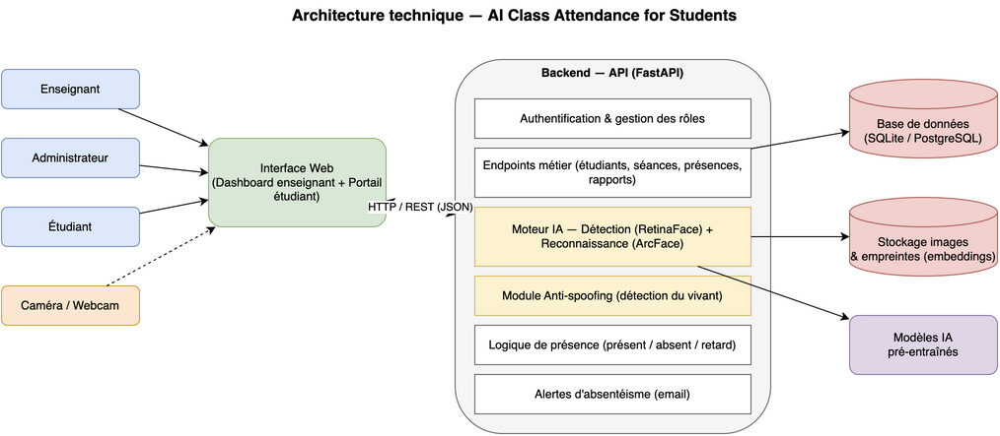{ width=15cm }

La première couche est l'interface web. C'est par elle que l'enseignant lance une prise de présence, vérifie la liste proposée et consulte ses rapports, et c'est par elle également que l'étudiant accède à son taux de présence. Cette interface ne contient aucune logique métier : elle se contente de présenter les informations et de transmettre les demandes à la couche suivante.

La deuxième couche est le serveur applicatif, exposé sous la forme d'une interface de programmation. Elle concentre l'essentiel du travail. On y trouve l'authentification et la gestion des rôles, qui déterminent ce que chaque utilisateur a le droit de faire, les points d'accès métier qui manipulent les étudiants, les séances, les présences et les rapports, et surtout le moteur d'intelligence artificielle. Ce moteur enchaîne la détection des visages par RetinaFace, leur reconnaissance par ArcFace, et le contrôle anti-fraude, avant de confier le résultat à la logique de présence qui décide, pour chaque étudiant, du statut à enregistrer. Un module d'alerte complète l'ensemble en signalant l'absentéisme par courriel.

La troisième couche assure la persistance. La base de données conserve les entités pédagogiques et l'historique des présences ; un espace de stockage distinct héberge les images d'enrôlement et, surtout, les empreintes numériques des visages, que nous privilégions par souci de minimisation ; enfin, les modèles pré-entraînés sont chargés par le moteur au démarrage. Cette séparation entre données métier, données biométriques et modèles n'est pas seulement une commodité technique : elle facilite la sécurisation de ce qui doit l'être en priorité.

## 3.3 Spécification des besoins et cas d'utilisation

Trois acteurs interagissent avec le système, auxquels s'ajoute le système lui-même lorsqu'il agit de sa propre initiative. L'enseignant est l'utilisateur central : il déclenche l'appel sur une séance, valide ou corrige la liste des présents que le système lui soumet, et consulte les rapports d'assiduité de ses modules. L'administrateur, ou le responsable pédagogique, prépare le terrain en gérant les comptes, les classes, les modules et les séances, et surtout en enrôlant les étudiants, c'est-à-dire en associant à chacun les photographies qui serviront de référence. L'étudiant, enfin, dispose d'un accès limité à la consultation de sa propre assiduité. Quant au système, il joue un rôle actif lorsqu'il reconnaît les visages et lorsqu'il émet, sans intervention humaine, une alerte d'absentéisme. La figure 3.2 rassemble ces interactions dans le diagramme de cas d'utilisation.

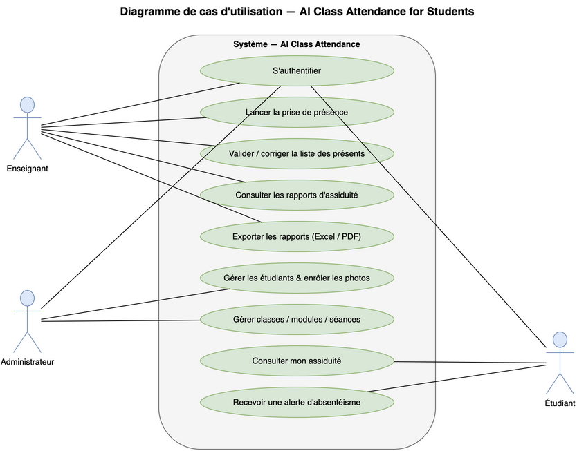{ width=13cm }

Un point de conception mérite d'être souligné dès maintenant. Nous avons délibérément maintenu l'enseignant dans la boucle : le système ne valide jamais seul une présence de manière définitive, il propose une liste que l'enseignant confirme. Ce choix répond directement aux limites relevées dans l'état de l'art, où la précision se dégrade en conditions réelles ; il garantit qu'une erreur de reconnaissance reste corrigible et que la responsabilité finale demeure humaine.

## 3.4 Conception détaillée

### Le déroulé de la reconnaissance

Lorsqu'une image de classe parvient au moteur, elle traverse une séquence de traitements dont chaque étape prépare la suivante. La détection localise d'abord tous les visages et fournit leurs points caractéristiques ; l'alignement s'en sert pour recadrer et redresser chaque visage ; l'extraction transforme alors chaque visage en une empreinte numérique. Cette empreinte est comparée à celles des étudiants enrôlés au moyen d'une distance cosinus, et l'identité n'est retenue que si la ressemblance franchit un seuil que nous calibrerons expérimentalement. Le contrôle anti-fraude intervient pour écarter les visages qui ne proviendraient pas d'une personne réelle. Le résultat, enfin, est transmis à la logique de présence, qui l'inscrit provisoirement en attendant la validation de l'enseignant.

### Diagramme de classes

La structure statique du système est décrite par le diagramme de classes de la figure 3.3. Il fait apparaître les entités qui composent le domaine — l'enseignant, l'étudiant, la classe, le module, la séance et la présence — ainsi que les empreintes de référence rattachées à chaque étudiant. Ces classes et leurs associations se traduisent directement dans le modèle de données présenté plus loin.

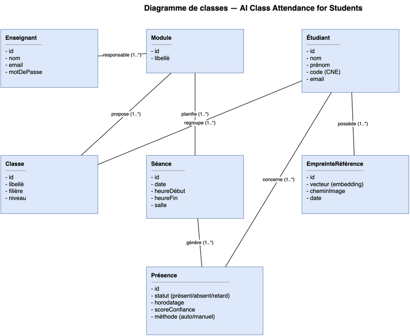{ width=15cm }

### Diagramme de séquence

Le scénario le plus représentatif du système est la prise de présence. La figure 3.4 en détaille l'enchaînement, depuis le moment où l'enseignant soumet une image jusqu'à l'enregistrement final. On y suit la requête qui part de l'interface, traverse le serveur, sollicite le moteur d'intelligence artificielle, revient à l'enseignant sous la forme d'une liste à valider, puis se conclut par l'écriture des présences en base. Ce diagramme met en évidence l'étape de validation humaine évoquée plus haut, qui s'intercale entre la proposition automatique et l'enregistrement définitif.

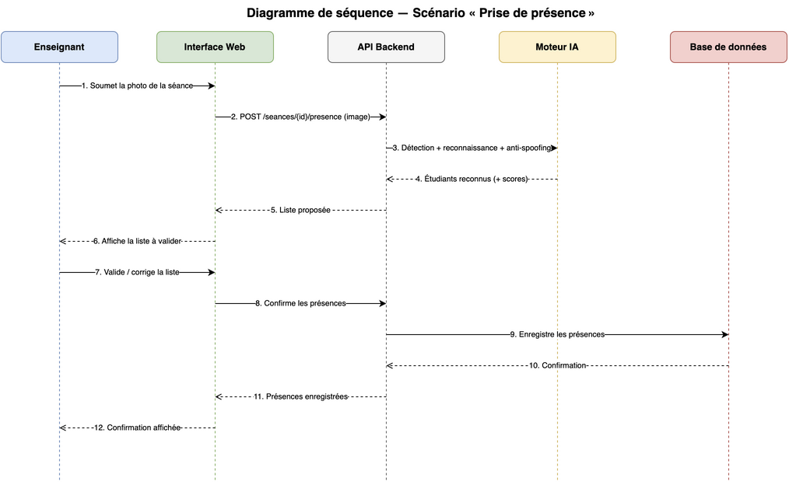{ width=15cm }

## 3.5 Modèle de données

Le modèle de données prolonge le diagramme de classes en précisant les tables et leurs relations. Un enseignant est responsable d'un ou plusieurs modules, chaque module étant rattaché à une classe et donnant lieu à une succession de séances datées. Chaque étudiant appartient à une classe et se voit associer une ou plusieurs empreintes de référence, calculées lors de l'enrôlement. La présence, enfin, est l'entité qui fait le lien entre un étudiant et une séance : elle porte le statut retenu — présent, absent ou en retard —, l'horodatage, le score de confiance de la reconnaissance et l'indication de la méthode, automatique ou corrigée manuellement. Conserver ce score et cette méthode n'est pas un détail : cela nous permettra, au moment de l'évaluation, de distinguer ce que le système a correctement reconnu de ce que l'enseignant a dû rectifier.

## 3.6 Conclusion

L'architecture que nous venons de décrire répond aux objectifs fixés tout en tenant compte des enseignements de l'état de l'art. Elle isole le moteur intelligent pour pouvoir le faire évoluer, elle protège les données sensibles en les séparant et en privilégiant les empreintes aux images, et elle conserve à l'enseignant le dernier mot sur chaque présence. Le chapitre suivant décrit comment cette conception se concrétise en une application fonctionnelle.

# Chapitre 4 — Implémentation / Réalisation

## 4.1 Introduction

La conception décrite au chapitre précédent s'est concrétisée en une application fonctionnelle, développée de façon incrémentale : nous avons d'abord donné vie au cœur intelligent du système, puis bâti autour de lui le service applicatif et la base de données, et enfin l'interface destinée à l'enseignant. Ce chapitre décrit cette réalisation, l'environnement dans lequel elle a été menée, le traitement des données, et la manière dont nous avons vérifié à chaque étape que le résultat fonctionnait réellement.

## 4.2 Environnement de travail

Le développement a été mené en Python 3.12, sur un ordinateur portable équipé d'un processeur Apple Silicon, sans carte graphique dédiée — un choix assumé, puisque l'un de nos objectifs était de faire fonctionner le système sur du matériel courant. Les dépendances ont été isolées dans un environnement virtuel afin de garantir la reproductibilité de l'installation.

Le cœur de reconnaissance repose sur la bibliothèque InsightFace et sur son moteur d'exécution ONNX Runtime, qui charge les modèles pré-entraînés et les fait tourner sur le processeur ; le traitement des images s'appuie sur OpenCV. Côté service, nous avons retenu FastAPI pour l'interface de programmation, SQLAlchemy pour l'accès aux données et SQLite comme base, cette dernière ne demandant aucune installation de serveur. L'interface est rendue côté serveur au moyen des gabarits Jinja2, et les rapports sont exportés grâce à openpyxl pour Excel et à ReportLab pour le PDF. Conformément à notre parti pris, aucun modèle n'a été entraîné : le pack `buffalo_l` d'InsightFace, qui réunit le détecteur RetinaFace et le modèle de reconnaissance ArcFace, est téléchargé automatiquement au premier lancement.

## 4.3 Le moteur de reconnaissance

Le moteur est encapsulé dans une classe unique qui masque la complexité d'InsightFace derrière une opération simple : à partir d'une image, elle renvoie la liste des visages détectés, chacun accompagné de sa position, de son empreinte et d'un score de détection. L'empreinte est un vecteur de 512 valeurs déjà normalisé, ce qui présente un avantage pratique appréciable — la similarité cosinus entre deux visages se réduit alors à un simple produit scalaire.

L'identification d'un visage inconnu consiste à comparer son empreinte à celles des étudiants enrôlés et à retenir l'étudiant le plus proche, à condition que la similarité dépasse le seuil fixé ; en deçà, le visage est déclaré inconnu plutôt que rattaché à tort à quelqu'un. L'enrôlement suit la même logique en sens inverse : pour chaque étudiant, on calcule l'empreinte de plusieurs photographies, et ce sont ces empreintes — et non les images — que l'on conserve, par souci de minimisation des données.

## 4.4 Le backend et la base de données

Le service applicatif organise le travail selon l'architecture en trois couches présentée au chapitre 3. La base de données matérialise les sept entités du modèle — enseignant, classe, module, séance, étudiant, empreinte de référence et présence — avec leurs relations. L'interface de programmation expose les opérations attendues : créer et lister les étudiants, les enrôler à partir de photographies, gérer les entités académiques, lancer la reconnaissance sur une photographie de séance, valider les présences et consulter les rapports d'assiduité.

Un point de conception s'est traduit fidèlement dans le code : la reconnaissance ne fait que *proposer* une liste de présents ; l'enregistrement effectif n'a lieu qu'après validation. L'opération de reconnaissance renvoie donc les visages identifiés sans rien écrire en base, et c'est un second appel, déclenché par l'enseignant, qui enregistre les présences confirmées.

## 4.5 Le tableau de bord

L'enseignant n'interagit jamais directement avec l'interface de programmation : il passe par un tableau de bord web. La page d'accueil résume l'activité — nombre d'étudiants, de séances, de présences — et liste les dernières séances. Une page permet d'inscrire les étudiants et de les enrôler en téléversant leurs photographies. La page centrale est celle de la prise de présence : l'enseignant y choisit une séance, importe une photographie de la classe, et obtient en retour cette même image annotée, chaque visage entouré et nommé, accompagnée de la liste des étudiants reconnus qu'il ne lui reste qu'à cocher avant de valider. Lorsque le modèle de détection du vivant est présent, chaque visage est de surcroît contrôlé, et ceux qui paraissent suspects — susceptibles de provenir d'une photographie présentée à la caméra — sont signalés en orange. La page des rapports, enfin, affiche le taux d'assiduité par module et permet de l'exporter en Excel ou en PDF. Deux services complètent le dispositif : un portail où l'étudiant consulte son propre taux de présence, et un mécanisme d'alerte qui repère automatiquement les étudiants passés sous un seuil d'assiduité et prépare les courriels de relance correspondants. Nous avons volontairement rendu cette interface autonome, ses styles étant intégrés à la page elle-même, afin de ne dépendre d'aucune ressource extérieure le jour de la démonstration.

## 4.6 Traitement des données

Les données manipulées sont de deux natures. Les photographies d'enrôlement, d'abord, dont on extrait le visage principal pour en calculer l'empreinte ; le prétraitement — détection, alignement, normalisation — est pris en charge par le moteur lui-même, ce qui garantit la cohérence entre l'enrôlement et la reconnaissance. Les photographies de séance, ensuite, sur lesquelles tous les visages sont détectés puis comparés à la base. À aucun moment les images ne sont indispensables au fonctionnement courant : une fois les empreintes calculées, ce sont elles qui portent l'information utile, ce qui limite la quantité de données personnelles conservées.

## 4.7 Démarche de validation

Fidèles au principe selon lequel un logiciel n'est réputé fonctionner que lorsqu'on l'a vu fonctionner, nous avons accompagné le développement de scripts de vérification. Un premier scénario, exécuté de bout en bout, crée une classe et un module, enrôle plusieurs étudiants, lance la reconnaissance sur une photographie mise de côté, valide les présences et consulte le rapport, en contrôlant à chaque étape la cohérence du résultat. Un second exerce les pages du tableau de bord et confirme que la prise de présence produit bien l'image annotée attendue. Cette discipline a porté ses fruits : elle nous a permis de détecter et de corriger deux défauts qui seraient autrement passés inaperçus — une dépendance manquante et une collision de noms dans la validation des données — précisément parce que nous avons exécuté le code au lieu de supposer qu'il était correct.

## 4.8 Conclusion

Au terme de cette étape, le système remplit sa fonction première : enrôler des étudiants, reconnaître les présents sur une photographie et restituer l'information à l'enseignant sous une forme exploitable. Le chapitre suivant en mesure les performances.

# Chapitre 5 — Présentation des résultats

## 5.1 Protocole d'évaluation

Évaluer un système de reconnaissance ne se résume pas à constater qu'il « marche » sur quelques images. Il faut un protocole reproductible, des données dont on connaît la vérité, et des métriques qui rendent compte à la fois de ce que le système reconnaît correctement et de ce qu'il pourrait confondre. Nous avons donc conduit une première évaluation en conditions contrôlées, avant de tester le système sur nos propres photographies.

Pour cette première évaluation, nous nous sommes appuyés sur le jeu de données public **LFW** (*Labeled Faces in the Wild*), qui fait référence dans la littérature et sur lequel sont établis les benchmarks cités au chapitre 2. Utiliser LFW présente un double avantage : les identités y sont connues, ce qui permet de mesurer objectivement la justesse des reconnaissances, et les résultats sont directement comparables à ceux de l'état de l'art. Ce jeu ne sert bien entendu qu'à l'évaluation technique, et non à l'application déployée.

Le protocole reproduit le fonctionnement réel du système. Pour chaque personne, nous avons utilisé trois photographies pour l'**enrôlement** — comme le ferait l'administrateur en constituant la base de référence — et conservé les photographies restantes pour le **test**. L'évaluation a porté sur quinze identités et cinquante-six photographies de test. Deux familles de métriques ont été calculées : la **précision d'identification** (le système attribue-t-il la bonne identité ?) et, pour le réglage du seuil de décision, les **taux de fausses acceptations (FAR)** et de **faux rejets (FRR)**.

## 5.2 Résultats de reconnaissance

Au seuil de similarité retenu, la précision d'identification atteint **100 %** sur l'ensemble des photographies de test : chaque visage a été rattaché à la bonne personne. Ce résultat, remarquable, s'explique par la qualité de séparation des empreintes, que résume le tableau suivant.

| Indicateur | Valeur |
|---|---|
| Identités évaluées | 15 |
| Photographies de test | 56 |
| Précision d'identification (top-1) | 100 % |
| Similarité moyenne — même personne | 0,726 |
| Similarité minimale — même personne | 0,602 |
| Similarité moyenne — personnes différentes | 0,029 |
| Similarité maximale — personnes différentes | 0,245 |

La lecture de ces chiffres est éclairante. La plus faible similarité observée entre deux photographies d'une même personne (0,602) reste très supérieure à la plus forte similarité observée entre deux personnes différentes (0,245). Autrement dit, il existe un large **fossé** entre les distributions des vrais appariements et des faux, ce qui rend la décision aisée et robuste. La figure 5.1 rend ce constat visuel : les deux distributions ne se recouvrent pas.

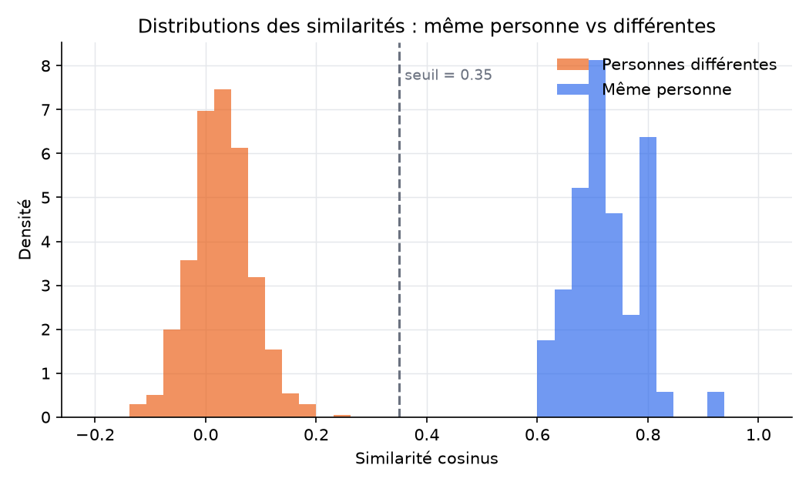{ width=13cm }

## 5.3 Calibration du seuil de décision

Ce fossé se traduit directement dans le comportement du seuil. En le faisant varier de 0,20 à 0,50, les taux de fausses acceptations et de faux rejets restent tous deux nuls ou négligeables : aucune valeur de cette plage ne provoque d'erreur sur notre échantillon. Nous avons retenu **0,35**, situé au centre de cette zone sûre, comme compromis par défaut. Ce réglage n'est pas figé : sur des données plus difficiles, on privilégiera un seuil légèrement plus bas pour ne pas rejeter des étudiants réellement présents, quitte à laisser l'enseignant corriger les rares confusions. La figure 5.2 montre l'évolution des deux taux d'erreur en fonction du seuil et met en évidence la plage de valeurs pour lesquelles ils restent nuls.

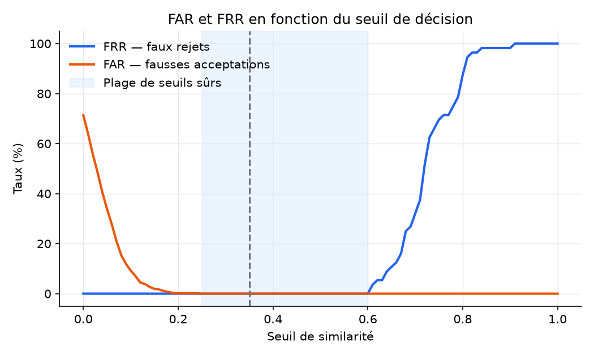{ width=13cm }

## 5.4 Discussion et limites

Ces résultats valident sans ambiguïté le cœur du système : la chaîne détection–empreinte–appariement fonctionne et discrimine les identités avec une marge confortable. Ils doivent cependant être interprétés pour ce qu'ils sont, une **référence en conditions contrôlées**. Les images de LFW sont de bonne qualité, majoritairement de face, et ne contiennent qu'un seul visage bien cadré. Or, comme le soulignait l'état de l'art, les performances se dégradent en conditions réelles : éclairage inégal d'une salle, visages de profil ou partiellement masqués, distance à la caméra, densité de la classe. Nous nous attendons donc à une précision inférieure sur nos propres photographies de classe, et c'est précisément cette confrontation au réel qui donnera toute sa valeur à l'évaluation.

## 5.5 Mise à l'épreuve en configuration multi-visages

L'évaluation précédente, conduite sur des images ne comportant qu'un seul visage bien cadré, mesure la qualité intrinsèque de la reconnaissance mais ne dit rien de la situation qui nous intéresse réellement : une salle où plusieurs personnes apparaissent en même temps. Nous avons donc mis le système à l'épreuve dans sa configuration d'usage. Une promotion de six étudiants a été enrôlée dans l'application, puis nous avons soumis au moteur une photographie de classe rassemblant ces six étudiants ainsi que deux personnes non inscrites, jouant le rôle d'intrus. Faute de photographies d'étudiants réels accompagnées des consentements nécessaires, la démonstration s'appuie sur des portraits libres de droits — modèles consentants ; en exploitation, ce seraient les photographies des étudiants réellement enrôlés qui seraient utilisées.

Sur cette photographie de classe, le moteur a détecté les huit visages, reconnu sans erreur les six étudiants inscrits — chacun nommé, avec un score de similarité élevé compris entre 0,89 et 0,98 — et rejeté correctement les deux intrus, signalés comme « Inconnu ». Le traitement complet de l'image a demandé environ deux secondes sur un simple ordinateur portable. La figure 5.3 en donne le résultat annoté.

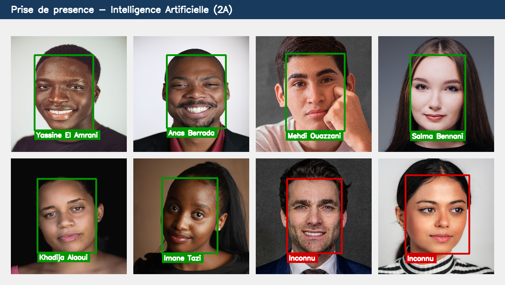{ width=14cm }

Ce résultat confirme le comportement attendu d'une prise de présence : la détection retrouve tous les visages, la reconnaissance attribue la bonne identité à chacun des étudiants inscrits, et le seuil écarte les personnes étrangères au groupe. Il illustre concrètement l'enchaînement complet — détection, reconnaissance, décision — sur une image contenant plusieurs visages, tel qu'il se déroule lors d'une prise de présence réelle.

Ces portraits restent toutefois nets et majoritairement de face. Une salle réelle ajouterait des difficultés que notre évaluation n'a pas encore éprouvées : éclairage inégal, visages de profil ou partiellement masqués, distance à la caméra, densité de la classe, sans oublier les personnes présentes à l'arrière-plan, susceptibles de provoquer de fausses détections. C'est précisément là qu'intervient la validation par l'enseignant, qui corrige la liste avant l'enregistrement ; et c'est cette confrontation au terrain, avec le consentement des personnes concernées, qui constitue la première des perspectives que nous traçons au chapitre suivant.

# Chapitre 6 — Conclusion générale et perspectives

## 6.1 Bilan

Ce projet est parti d'un constat simple : la prise de présence en classe, telle qu'elle se pratique encore, coûte du temps, se prête à la fraude et ne produit aucune donnée exploitable. Nous avons cherché à y répondre en concevant et en réalisant un système capable de reconnaître automatiquement les étudiants présents à partir de leur visage, puis d'enregistrer et de restituer ces présences.

Le résultat est une application complète et fonctionnelle. Elle permet d'enrôler les étudiants, de reconnaître les visages sur une photographie de classe, de laisser l'enseignant valider la liste proposée, de conserver l'historique des présences et d'en tirer des rapports d'assiduité exportables. Son cœur repose sur des modèles de l'état de l'art — RetinaFace pour la détection, ArcFace pour la reconnaissance — que nous avons intégrés plutôt que réinventés, et son évaluation sur un jeu de données public a confirmé la solidité de l'approche, avec une séparation très nette entre les visages d'une même personne et ceux de personnes différentes.

## 6.2 Apports

Au-delà de l'outil lui-même, ce travail nous a permis de mener un projet informatique de bout en bout, depuis la définition du besoin jusqu'à la validation, en passant par l'étude de l'existant et la conception. Nous en retenons trois apports que nous jugeons importants. D'abord, une application réellement utilisable, et non une simple démonstration de laboratoire. Ensuite, une attention constante à la protection des données : parce que le visage est une donnée biométrique, nous avons choisi de conserver les empreintes plutôt que les images, de prévoir le consentement des personnes et de replacer le projet dans le cadre de la loi 09-08. Enfin, une évaluation honnête, qui distingue ce qui a été mesuré en conditions contrôlées de ce qui reste à éprouver en situation réelle.

## 6.3 Limites

Nous sommes conscients des limites de ce travail. Les performances remarquables que nous avons obtenues l'ont été sur des images de bonne qualité ; la salle de classe, avec son éclairage inégal, ses visages de profil et sa densité, constituera une épreuve plus sévère. Le jeu de données utilisé pour l'évaluation reste par ailleurs modeste. Enfin, si nous avons intégré un module de détection du vivant qui reconnaît correctement un visage réel, la validation de son efficacité face à une véritable attaque — photographie imprimée ou écran — n'a pas pu être menée faute d'images d'attaque ; de même, la reconnaissance en flux vidéo temps réel, développée mais tributaire d'une webcam, reste à éprouver en conditions réelles.

## 6.4 Perspectives

Plusieurs prolongements naturels s'offrent à ce travail. Le plus immédiat consiste à confronter le système à de vraies photographies de classe, afin d'en calibrer le seuil sur des conditions réelles et d'en mesurer honnêtement la précision. Viennent ensuite la validation de la détection du vivant contre de véritables attaques et la mise à l'épreuve de la reconnaissance en temps réel par webcam, l'une et l'autre déjà implémentées mais à confronter au terrain. On peut également envisager d'automatiser les alertes d'absentéisme, d'ouvrir aux étudiants un accès à leur propre assiduité, puis, à plus longue échéance, une application mobile et une intégration au système d'information de l'établissement. Chacune de ces pistes s'appuierait sur l'architecture modulaire que nous avons mise en place, conçue précisément pour accueillir ces évolutions.

## 6.5 Mot de la fin

Ce projet nous aura appris qu'un système d'intelligence artificielle utile ne se résume pas à un modèle performant : il tient tout autant à la manière dont on l'intègre, dont on protège les données qu'il manipule et dont on en évalue honnêtement les limites. C'est cette exigence, plus encore que la reconnaissance faciale elle-même, que nous retiendrons de ce travail.


# Références

[1] *Automated Face Recognition based Attendance System using RetinaFace and FaceNet*, academia.edu. <https://www.academia.edu/117301737/>

[2] *Face Recognition-Based Smart Attendance Monitoring System in Classroom*, Springer, 2024. <https://link.springer.com/chapter/10.1007/978-981-99-9436-6_28>

[3] *Enhancing Classroom Attendance Systems with Face Recognition through CCTV using Deep Learning*, ScienceDirect, 2025. <https://www.sciencedirect.com/science/article/pii/S1877050925016655>

[4] *Comparaison ArcFace / FaceNet / dlib sur le jeu LFW*, viso.ai (et arXiv 2507.03541). <https://viso.ai/computer-vision/deepface/>

[5] *Deep Learning for Face Anti-Spoofing: A Survey*, arXiv 2106.14948. <https://arxiv.org/pdf/2106.14948>

[6] *Morocco Data Protection Law 09-08 (CNDP) — Guide*, DPO Consulting, 2026. <https://www.dpo-consulting.com/blog/morocco-data-protection-law-09-08>

[7] *Face Recognition-Based Mass Attendance Using YOLOv5 and ArcFace*, ResearchGate, 2023. <https://www.researchgate.net/publication/371480244>

[8] *A Review Paper on Face Recognition Based Attendance System*, IJIREEICE, 2024. <https://ijireeice.com/wp-content/uploads/2024/02/IJIREEICE.2024.12208.pdf>

[9] *AI-Based Face Recognition Attendance (OpenCV, DeepFace, ArcFace, RetinaFace)*, dépôt GitHub de référence. <https://github.com/asrarahemed/AI-Based-Face-Recognition-Attendance-Management-System>

# Annexes

## Annexe A — Captures d'écran de l'application

Les captures ci-dessous présentent l'application telle qu'elle apparaît à l'enseignant. L'interface est autonome — ses styles sont intégrés à la page — et s'ouvre dans un simple navigateur, sans installation côté client.

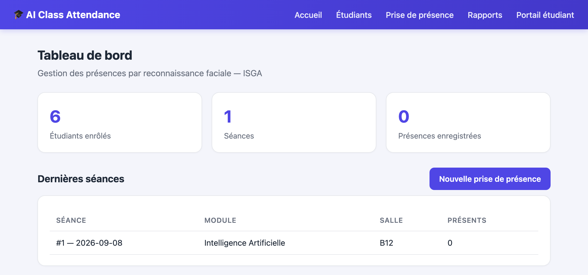{ width=15cm }

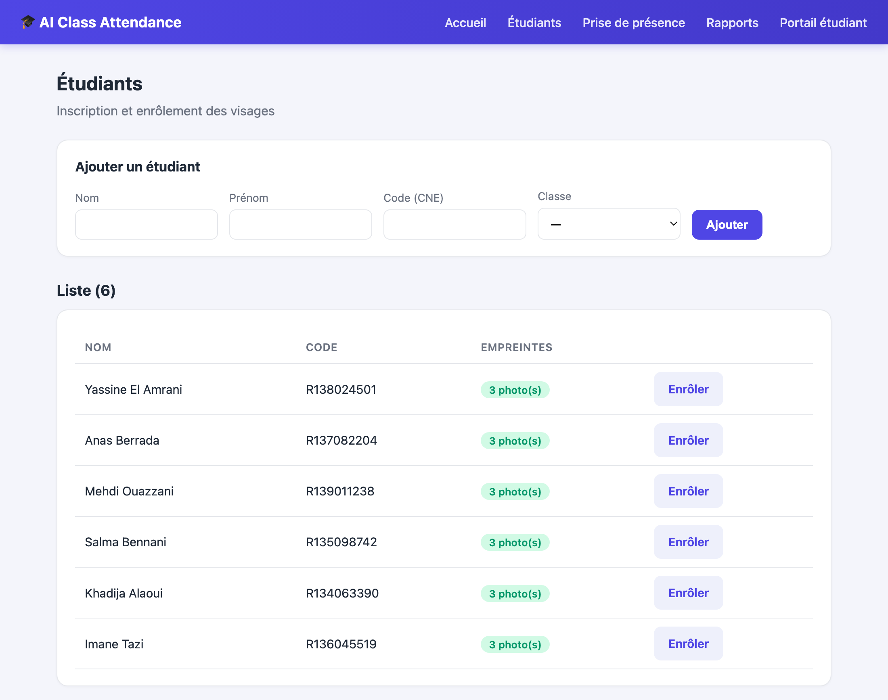{ width=15cm }

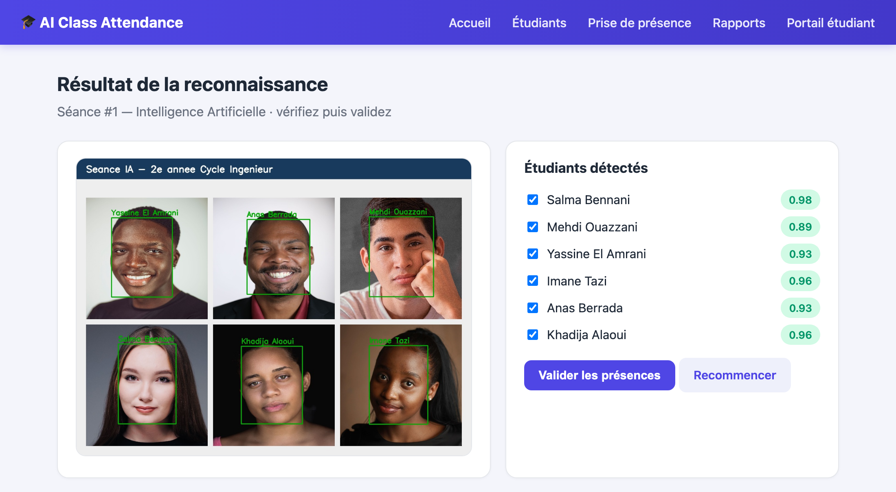{ width=15cm }

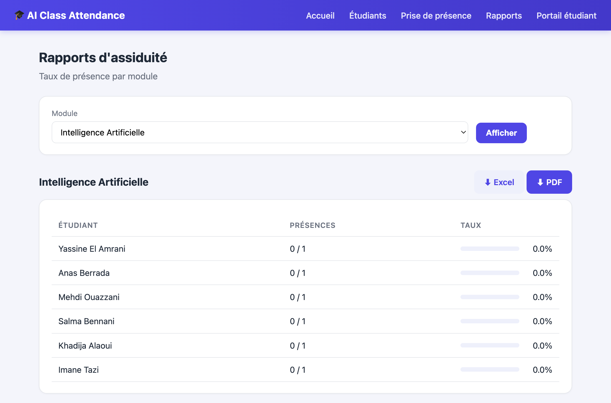{ width=15cm }

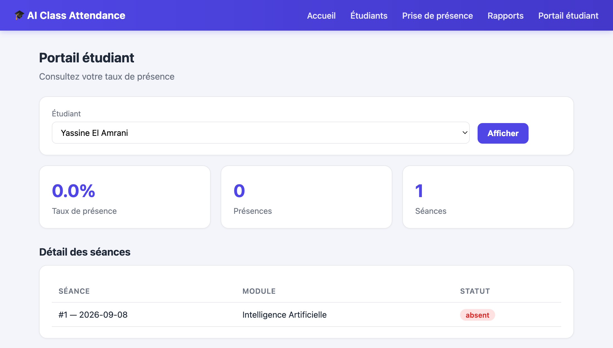{ width=13cm }

## Annexe B — Extrait de code : le cœur de la reconnaissance

Le moteur expose une opération unique, `identify`, qui compare l'empreinte d'un visage inconnu à celles des étudiants enrôlés et retient l'identité la plus proche, à condition que la similarité dépasse le seuil calibré. Les empreintes fournies par ArcFace étant déjà normalisées, la similarité cosinus se réduit à un simple produit scalaire.

```python
def identify(embedding, db, threshold):
    """Renvoie (nom, similarité) si la meilleure correspondance dépasse le seuil,
    sinon (None, similarité) — le visage est alors déclaré « Inconnu »."""
    e = embedding / (np.linalg.norm(embedding) + 1e-8)
    best_name, best_sim = None, -1.0
    for name, embs in db.items():
        sim = float(np.max(embs @ e))        # meilleure photo de référence de l'étudiant
        if sim > best_sim:
            best_sim, best_name = sim, name
    return (best_name, best_sim) if best_sim >= threshold else (None, best_sim)
```

## Annexe C — Formulaire de consentement

Ce formulaire matérialise le consentement explicite exigé par la loi 09-08 avant tout enrôlement. Il est présenté et signé par chaque personne dont le visage est enregistré.

**Responsables du traitement (équipe projet) :** BENDADI Mohamed, SADEK Zakaria, BELHASSAN Amine. **Encadrant :** M. Adama SAMAKE. **Cadre :** projet académique, à but exclusivement pédagogique et expérimental.

**Objet.** Le projet met en œuvre un système de prise de présence fondé sur la reconnaissance faciale ; il traite à ce titre des **données biométriques**, considérées comme sensibles au sens de la **loi n° 09-08**, sous le contrôle de la **CNDP**.

**Données collectées.** Nom, prénom et identifiant de l'étudiant ; quelques photographies du visage servant à l'enrôlement ; les empreintes numériques calculées à partir de ces photographies.

**Finalité.** Ces données servent uniquement à identifier la personne lors de la prise de présence et à l'évaluation technique du système dans le cadre du PFA, à l'exclusion de toute autre finalité.

**Engagements de l'équipe.** Minimisation (on conserve de préférence les empreintes plutôt que les images) ; accès restreint aux seuls membres de l'équipe et données non diffusées ; aucune publication de données personnelles, y compris dans le code versionné ; suppression des données à la fin du projet ou à la demande de la personne ; droit d'accès, de rectification, de suppression et de retrait du consentement à tout moment.

> Je soussigné(e) …………………………………………………………, reconnais avoir été informé(e) de la finalité et des modalités du traitement décrites ci-dessus, et **consens librement** à ce que mes photographies et les empreintes qui en dérivent soient collectées et utilisées dans le cadre de ce projet académique.
>
> Fait à ……………………… le ……… / ……… / 20……… — Signature :

## Annexe D — Charte de confidentialité

En complément du consentement individuel, l'équipe s'astreint à une charte simple, qui reprend les principes de la loi 09-08 appliqués à l'échelle du projet :

- **Finalité déterminée :** les données ne servent qu'à la gestion des présences et à l'évaluation du système.
- **Minimisation :** on stocke les empreintes numériques de préférence aux images, et l'on ne collecte que les informations strictement nécessaires.
- **Sécurité :** accès limité aux membres de l'équipe, mots de passe hachés, données jamais versionnées ni diffusées.
- **Transparence et droits :** chaque personne est informée, consent explicitement, et peut à tout moment consulter, rectifier ou supprimer ses données et retirer son consentement.
- **Conservation limitée :** les données sont effacées à l'issue du projet.

Pour un déploiement réel, hors cadre pédagogique, une déclaration ou une autorisation préalable auprès de la CNDP serait en outre nécessaire.
